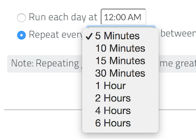

# Developing a Python App
<br/>
<br/>
This section provides an overview of the Python App development process and how to package your App for deployment to the ThreatConnect&trade; platform.

* * *

## Supported Version
<br/>

The current supported version for Private/Public Cloud deployment Python Apps is 2.7.  This Python version is typically pre-installed on Linux/MacOS/Unix systems. 
On-Premise clients don`t have this restriction. They simply need to ensure the Python runtime is available in their PATH environment variable.

<br/>
* * *

## Third Party Libraries
<br/>

Third party libraries are restricted to the following list at this point in time. Private & Public Cloud deployments will need to contact
support@threatconnect.com to request additional third party libraries not on this list.
<br/>
<br/>

Name          | Version       | Link
------------- | ------------- | ----------------------
threatconnect | 2.0.0         | https://github.com/ThreatConnect-Inc/threatconnect-python
requests      | 2.6.0         | http://docs.python-requests.org/en/latest/
enum34        | 1.0.4         | https://pypi.python.org/pypi/enum34

<br/>
* * *

## Deployment Structure
<br/>
The installation package (a zip file) involves two types of assets, an installation configuration file named `install.conf` and your runtime Python script(s). The System Administrator directly installs the package on the server so it can be displayed for Job creation.
<br/>
<br/>

* * *

## Install Configuration File
<br/>
All App deployments require an `install.conf` file in the base directory of the project. This file is effectively a deployment descriptor used by ThreatConnect&trade;
to display and save Job configurations for each App. Below is the structure of the file with description.

Property                     | Allowed Values    | Description                                                                                                                           |
---------------------------- | :-----------------: | ------------------------------------------------------------------------------------------------------------------------------------- |
`program.version`              | -                 | The program version displayed during Job creation/editing within ThreatConnect&trade;.  Although there is no restriction on how to version your App, the convention typically used is `<major>.<minor>.<patch>`                                                 |
`program.language`             | JAVA <br/> PYTHON | ThreatConnect&trade; uses this field to select the proper runtime to execute the App                                                 |
`language.version`             | -                 | ThreatConnect&trade; uses this field to select the proper runtime version to execute the App                                         |
`program.main`                 | -                 | The main script or class to be called on each job execution                                                                           |
`allow.onDemand`               | true <br/> false  | Flag defining whether this program should be allowed to run on demand. Job creator will be presented with a checkbox if this is set to true.      |
`repeating.minutes`            | _&lt;integer&gt;_[,_integer_] | (Optional) Comma-separated list of minute values restricting repeating Jobs from running under certain intervals
`list.delimiter`               | -                 | Any character or set of characters that will be used to tokenize a parameter designated as a list in the params section |
`param.<param-name>`           | -                 | Parameter name to be displayed within ThreatConnect&trade; Job creation. Avoid using the period ('.') or dash ('-') characters in the parameter name. The property value to the right of the '=' sign will be used as a default value in the Job creator. |
`param.<param-name>.label` | -               | A parameter description to be displayed to the Job creator |
`param.<param-name>.list`  | -               | (Optional) Flag designating this parameter as a list without a property value. This parameter string will be tokenized using the list.delimiter property. The '=' character is not required. |
`param.<param-name>.flag`  | -               | (Optional) Flag designating this parameter as a boolean without a property value. The Job creator will present a checkbox. The '=' character is not required. |
`param.<param-name>.encrypt`  | -               | (Optional) Flag designating this parameter as an encrypted value without a property value. The Job creator will present a password input field to the user. The '=' character is not required. |

<br/>
<br/>

Sample `install.conf` file:

    program.version = 1.0.0
    program.language = python
    language.version = 2.7.x
    program.main = opendns.py
    allow.onDemand = true
    repeating.minutes = 15,30,45,60,120,240,360
    list.delimiter = |
    param.api_access_id =
    param.api_access_id.label = ThreatConnect API Access ID
    param.api_secret_key =
    param.api_secret_key.label = ThreatConnect API Secret Key
    param.api_default_org =
    param.api_default_org.label = ThreatConnect Default Org Name
    param.api_max_results =
    param.opendns_key =
    param.opendns_key.label = OpenDNS API Key
    param.logging = info
    param.logging.label = Logging Level (debug, info, warning, error, critical)
    param.queue_sleep =
    param.queue_sleep.label = Seconds to sleep to allow processing of indicators by OpenDNS
    param.tags =
    param.tags.label = Delimited list of tag filters (e.g. APT|Crimeware).
    param.tags.list
    param.owners =
    param.owners.label = Delimited list of owners filters (e.g. Acme Corp|Common Community).
    param.owners.list
    param.date_added =
    param.date_added.label = Delimited list of relative date filters (e.g. >=,1,years|<=,1,days)
    param.date_added.list
    param.ratings =
    param.ratings.label = Delimited list of ratings filters (e.g. >=3.0|<=4.5)
    param.ratings.list
    param.confidences =
    param.confidences.label = Delimited list of confidences filters (e.g. >=75|<=95)
    param.confidences.list
    param.delete.flag =
    param.delete.label = Delete deprecated domains from OpenDNS block list

<br/>
<br/>

* * *

## Command Line Parameters
<br/>
The developer is strongly advised to use a standard library like [argparse](https://docs.python.org/3/library/argparse.html) to simplify command line parsing. Using the OpenDNS example configuration file defined above, and assuming a Job has been created to use this App, ThreatConnect&trade; will execute the job using the following format for Python Apps:

```
python opendns.py \
    --tc_log_path log \
    --tc_temp_path tmp \
    --tc_out_path out \
    --tc_api_path https://api.threatconnect.com \
    --api_access_id 1234567890 \
    --api_default_org Test & Org \
    --api_max_results 300 \
    --api_secret_key qwertyuiopasdfghjklzxcvbnm \
    --confidences >=,75 \
    --delete \
    --logging debug \
    --opendns_key x000000x-x0x0-0x00-x000-xx000x00000x \
    --owners Subscriber Community \
    --owners Test & Org \
    --queue_sleep 30 \
    --ratings >=,3.0 
```
<br/>
The above command can be parsed using the following Python code:

```python
import argparse

#
# parse args
#
parser = argparse.ArgumentParser()

# api args
parser.add_argument('--api_access_id', help='API Access ID', required=True)
parser.add_argument('--api_secret_key', help='API Secret Key', required=True)
parser.add_argument('--api_default_org', help='API Default Org', required=True)
parser.add_argument('--api_max_results', help='API Max Results', type=int)
parser.add_argument('--opendns_key', help='OpenDNS API Key')

# custom args
parser.add_argument('--logging', help='Logging Level', default='critical', choices=list(log_level.keys()))
parser.add_argument('--queue_sleep', help='Seconds to Sleep', default=60, type=int)
parser.add_argument('--delete', help='Delete deprecated entries from OpenDNS', action='store_true', default=False)

# api filter args
parser.add_argument('--modified_since', help='Modified Since Filter')
parser.add_argument('--owners', help='Owner Names', action='append')
parser.add_argument('--tags', help='Tag Filter', action='append')

# post filters
parser.add_argument('--date_added', help='Date Added Filter', action='append')
parser.add_argument('--last_modified', help='Last Modified Filter', action='append')
parser.add_argument('--ratings', help='Rating Filter', action='append')
parser.add_argument('--confidences', help='Confidence Filter', action='append')

# standard args
parser.add_argument('--tc_log_path', help='ThreatConnect log path', default='/tmp')
parser.add_argument('--tc_temp_path', help='ThreatConnect temp path', default='/tmp')
parser.add_argument('--tc_api_path', help='ThreatConnect api path', default='https://api.threatconnect.com')

# parse
args, unknown = parser.parse_known_args()
```

<br/>
* * *
## Optional Properties

There are some optional flags that may be used by the App to:

 * Restrict intervals for repeating jobs
 * Handle list parsing for parameter arrays
 * Handle boolean flags to turn features on/off
 * Encrypt parameters like API Keys

<br/>
### Repeating Job Intervals
<br/>
This optional property controls what interval (in minutes) the Job creator can use when creating a repeating job. 

> A Repeating Job is a Job that runs every day on an interval (i.e. every 30 minutes)

The following property:
```
    repeating.minutes = 5,10,15,30,60,120,240,360
```

Displays the following intervals in the repeating schedule picklist.

 
<br/>
<br/>

Multiple values should be separated by a comma `,`. All minutes greater than 60 will be discarded unless they are divisible by 60. If this property isn't provided, the following repeating intervals are defaulted during Job creation: `60, 120, 240, 360, 720`.
<br/>
<br/>

### Parsing Argument Lists 
<br/>
There is logic in place for parsing a list of values configured by the Job creator. In order to allow list parsing for a Python App, the `install.conf` file must include the `list.delimiter` property.  This value can be a single character or multi-character string.
```
list.delimiter = |
```
<br/>
Then each parameter that will allow passing lists must have the following flag. This enables the Job executor to pass this parameter in list form by tokenizing the string using the designated list delimiter. No equal sign or property value is required for this flag.

```
param.<param-name>.list
```
<br/>
Once those two properties are in place, the Python code must include the following option when the argument is added to the parser. This option allows argparse to convert duplicate parameters into a single list.

```
action='append'
```
<br/>
<br/>

### Parsing Argument Flags
<br/>
Apps can also use boolean flags to designate whether to turn on a specific feature. In the parsing code noted earlier, there is an example of an argument flag (`--delete`) configurable by the Job creator within ThreatConnect&trade;. The `install.conf` file must have the following flag present for a boolean parameter.

```
param.<param-name>.flag
```
<br/>
This property will direct the ThreatConnect&trade; application to show a checkbox to the Job creator. Once the Job is created, the flag will be passed to each Job execution without a parameter value. If the the flag is left unchecked during Job creation, then no flag is passed on each Job execution.
<br/>
<br/>

### Encrypted Parameters
<br/>
This property should be used to encrypt private passwords used by the App (i.e. API Keys). This added level of security will allow the application to persist the password in encrypted form when at rest. The input field during Job creation will be "password" text and the key will not be visible when typed. 

 

The install.conf property is defined for the encrypted parameter using the following flag:

```
param.<param-name>.encrypt
```
<br/>

At runtime, the App Engine will call the App with the decrypted key. At no point in time is the password persisted in decrypted form.
> The encrypt flag won't encrypt `.encrypted` parameters until the Keychain feature is enabled on the server. 
<br/>
<br/>
* * *

## TC Parameters
<br/>
ThreatConnect&trade; passes standard parameters to all Jobs within its standard sandbox container. There should be no assumptions made on the naming or existence of paths passed in these variables outside of the lifetime of the job execution. 

> Since all Job executions are run in a sandboxed environment, App developers should never hard-code TC Parameters 

TC Parameter   | Description                                                           |
-------------- | --------------------------------------------------------------------- |
`tc_log_path`  | Log path for the specific instance of the Job execution               |
`tc_tmp_path`  | Temporary storage path for the specific instance of the Job execution |
`tc_out_path`  | Output path for the specific instance of the Job execution            |
`tc_api_path`  | Path to the ThreatConnect API server                                  |


<br/>
* * *

## Results TC File

Job executions can use a special file called `results.tc` to write results as a mechanism for updating parameters for subsequent runs. A use case for this feature is an App that needs to know the last time it completed succesfully in order to process data since that completion. The parameter definitions are quite flexible with the only restriction that the parameters written to the `results.tc` file must exist in the `install.conf` file in order to be persisted.

Example `results.tc` file:

```
param.last_completed_time = 1430619556
```

Assuming there is a property with the same name in `install.conf`, the Job executor will update the new property value in the system for the next run. The property will only be stored if the Job execution is successful. 

> This file should be written to the `tc_out_path` passed as one of the standard TC parameters


<br/>
* * *

## Exit Codes
<br/>
There are standard exit codes that ThreatConnect&trade; uses to report whether a program completed successfully. The Python App is responsible for calling `sys.exit(N)` where 'N' is the appropriate exit code highlighted below.

> When `sys.exit()` is not called by your app, an exit code of zero is returned by default during normal code execution. System critical errors (i.e. file not found) return non-zero exit codes. The developer is responsible for catching and handling program errors accordingly.

At times a program may want to report a partial failure (i.e. batch process where X out of Y updates completed). In cases of partial failure, the System Administrator can retrieve the log file for that job execution and view more detailed output from the program run.  
<br/>

Status          | Description                                                    |
--------------- | -------------------------------------------------------------- |
Success         | Exit code 0 - Process completed successfully                   |
Partial Failure | Exit code 3 - Process had a partial failure                    |
Failure         | Any value not 0 or 3 (typically Exit code 1) - Process failed  |


* * *

## Wrapper Testing Utility
<br/>
The command line parameters can be extensive. To facilitate App development, there is a Python wrapper utility that takes a `tc.conf` file and calls a Python script with the properties from the configuration file as command line parameters. This simulates the way ThreatConnect&trade; would call the App in a production environment.

```sh
# =============================================================================
#
# Use this file with tc-wrapper.py to call any ThreatConnect integration script
# with these properties as command line arguments:
#
#   Example:
#
#       python tc-wrapper.py <my-script.py>
#
# =============================================================================

[threatconnect]

tc_log_path = /tmp

tc_out_path = /tmp

tc_temp_path = /tmp

tc_api_path = https://api.threatconnect.com

...

```
<br/>
The configuration file should be in the same location as your main Python script. Then call:

```

    python tc-wrapper.py <my-script.py>

```
<br/>
The wrapper calls your program with the parameters as ThreatConnect&trade; would:

```
python <my-script.py> \
    --tc_log_path /tmp \
    --tc_temp_path /tmp \
    --tc_out_path /tmp \
    --tc_api_path https://api.threatconnect.com \
    ...

```

* * *

## Python Examples

<br/>

 * [SDK Examples Directory](https://github.com/ThreatConnect-Inc/threatconnect-python/tree/master/examples)

* * *


